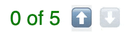

<center>

# StimulusX 

**⚡️ Reactivity engine for Stimulus controllers ⚡️**


 [](https://github.com/allmarkedup/stimulus-x/actions/workflows/ci.yml)

</center>

_StimulusX_ brings the power of **reactive programming** to [Stimulus](https://stimulus.hotwired.dev). It provides a **declarative syntax** for creating **live _controller&rarr;HTML_ connections** that greatly reduce the need for tedious manual DOM manipulation code in your controllers, making them cleaner, leaner and more flexible 😎

## Features

#### 🪢&nbsp; Automatic UI updates with reactive DOM bindings 

* Connect HTML attributes (and content) to controller properties using `data-bind-*` attributes in your markup.
* HTML attributes and content will automatically be kept in sync with the value of the properties they are bound to via the magic of _reactive data bindings_.
* Use chainable value modifiers to transform property values before applying to the DOM.

&nbsp;&nbsp;&nbsp; [**📚 Read the docs &rarr;**](#dom-bindings-overview)

#### 🧿&nbsp; Property watchers

* Watch any controller property for changes
* `[name]PropertyChanged` callback methods available for all watched properties

&nbsp;&nbsp;&nbsp; [**📚 Read the docs &rarr;**](#watching-properties)

#### 🧩&nbsp; Extensibility

* Straighforward **extension API**
* Add custom **modifiers** and **directives**

&nbsp;&nbsp;&nbsp; [**📚 Read the docs &rarr;**](#extending)

## Counter example

Below is an example of a simple `counter` controller implemented using StimulusX's reactive DOM bindings.

> [!TIP]
> _You can find a [runnable version of this example on JSfiddle &rarr;](https://jsfiddle.net/allmarkedup/q293ay8v/)_




```html
<div data-controller="counter">
  <div
    data-bind-attr="class~counter#validityClasses"
    data-bind-text="counter#displayText"
    class="display">
  </div>

  <button data-action="counter#increment">⬆️</button>
  <button data-action="counter#decrement">⬇️</button>
</div>
```

```js
// controllers/counter_controller.js
import { Controller } from "@hotwired/stimulus"

export default class extends Controller {
  static values = {
    count: Number,
    max: {
      type: Number,
      default: 5
    }
  }

  get displayText(){
    return `${this.countValue} of ${this.maxValue}`;
  }
  
  get validityClasses(){
    const valid = this.countValue <= this.maxValue;
    return {
      "text-green": valid,
      "text-red font-bold": !valid,
    }
  }

  increment(){
    this.countValue++;
  }

  decrement(){
    this.countValue--;
  }
}
```

---

> [!WARNING]
> _This project is very new. The API may still change and it has not been throughly battle-tested yet. Use with caution!_ 

## Installation

Add the `stimulus-x` package to your `package.json`:

#### Using NPM:

```
npm i stimulus-x
```

#### Using Yarn:

```
yarn add stimulus-x
```

## Usage

StimulusX hooks into your Stimulus application instance via the `StimulusX.init` method.

```js
import { Application, Controller } from "@hotwired/stimulus";
import StimulusX from "stimulus-x";

window.Stimulus = Application.start();

// You must call the `StimulusX.init` method _before_ registering any controllers.
StimulusX.init(Stimulus); 

// Register controllers as usual...
Stimulus.register("example", ExampleController);
```

By default, **all registered controllers** will automatically have access to StimulusX's reactive features - including [attribute bindings](#️attribute-bindings) (e.g. class names, `data-` and `aria-` attributes, `hidden` etc), [text content bindings](#text-bindings), [HTML bindings](#html-bindings) and more.

### Explicit controller opt-in

If you **don't want to automatically enable reactivity** for all of you controllers you can instead choose to _opt-in_ to StimulusX features on a controller-by-controller basis.

To enable individual controller opt-in pass `optIn: true` as an option when initializing StimulusX:

```js
StimulusX.init(Stimulus, { optIn: true }); 
```

To enable reactive features for a controller, set the `static reactive` variable to `true` in the controller class:

```js
import { Controller } from "@hotwired/stimulus"

export default class extends Controller {
  static reactive = true; // enable StimulusX reactive features for this controller
  // ...
}
```

<h2 id="dom-bindings-overview">Reactive DOM bindings overview</h2>

[HTML attributes](#attribute-binding), [text](#text-binding) and [HTML content](#text-binding) can be tied to the value of controller properties using `data-bind-*` attributes in your HTML.

These bindings are _reactive_ which means the DOM is **automatically updated** when the value of the controller properties change.

### Binding descriptors

Bindings are specified declaratively in your HTML using `data-bind-(attr|text|html)` attributes where the _value_ of the attribute is a **binding descriptor**.

**Attribute** binding descriptors take the form `attribute~identifier#property` where `attribute` is the name of the **HTML attribute** to set, `identifier` is the **controller identifier** and `property` is the **name of the property** to bind to.

```html
<!-- keep the `src` attribute value in sync with the value of the lightbox controller `.imageUrlValue` property -->

```

📚 ***Read more: [Attribute bindings &rarr;](#attribute-binding)***

**Text** and **HTML** binding descriptors take the form `identifier#property` where `identifier` is the **controller identifier** and `property` is the **name of the property** to bind to.

```html
<!-- keep `element.textContent` in sync with the value of the article controller `.titleValue` property -->
<h1 data-bind-text="article#titleValue"></h1>

<!-- keep `element.innerHTML` in sync with the value of the article controller `.proseContent` property -->
<div data-bind-html="article#proseContent"></div>
```

📚 ***Read more: [text bindings](#text-binding)*** _and_ ***[HTML bindings &rarr;](#html-binding)***

> [!NOTE]
> _If you are familiar with Stimulus [action descriptors](https://stimulus.hotwired.dev/reference/actions#descriptors) then binding descriptors should feel familiar as they have a similar role and syntax._

### Negating property values

Boolean property values can be negated (inverted) by prefixing the `identifier#property` part of the binding descriptor with an exclaimation mark:.

```html
<details data-bind-attr="open~!panel#closed"></details>
```

> [!NOTE]
> _The `!` prefix is really just an more concise alternative syntax for applying the `:not` modifier._

### Value modifiers

Inline _value modifiers_ are a convenient way to transform property values in situ before updating the DOM.

Modifiers are appended to the end of [binding descriptors](#binding-descriptors) and are separated from the descriptor (or from each other) by a `:` colon.

The example below uses the `upcase` modifier to transform the title  to upper case before displaying it on the page:

```html
<h1 data-bind-text="article#titleValue:upcase"></h1>
```

> [!TIP]
> _Multiple modifiers can be piped together one after each other, separated by colons, e.g. `article#titleValue:upcase:trim`_

StimulusX provides the following built-in modifiers:

* `:upcase` - transform text to uppercase
* `:downcase` - transform text to lowercase
* `:strip` - strip leading and trailing whitespace
* `:not` - negate (invert) a boolean value

> [!TIP]
> _If you need to you can add your own **custom modifiers** -
see [the section on extending StimulusX](#extending) for details._

<h2 id="attribute-bindings">🪢 Attribute bindings</h2>

Attribute bindings connect **HTML attribute values** to **controller properties**, and ensure that the attribute value is automatically updated so as to stay in sync with the value of the controller property at all times.

They are specified using `data-bind-attr` attributes with [value descriptors](#binding-descriptors) that take the general form `{attribute}~{identifier}#{property}`.

```html
<div data-controller="lightbox">
  
</div>
```

```js
export default class extends Controller {
  static values = {
    src: {
      type: String,
      default: "https://placeholder.com/kittens.jpg"
    }
  }
}
```

In the attribute binding descriptor `src~lightbox#srcValue` above:

* `src` is the **HTML attribute** to be added/updated/remove
* `lightbox` is the **controller identifier**
* `srcValue` is the **name of the property** that the attribute value should be bound to

So the image `src` attribute will initially be set to the default value of the `srcValue` property (i.e. `https://placeholder.com/kittens.jpg`). And whenever the `srcValue` property is changed, the image `src` attribute value in the DOM will be automatically updated to reflect the new value.

```js
this.srcValue = "https://kittens.com/daily-kitten.jpg"
// 
```

### Binding classes

`class` attribute bindings let you set specific classes on an element based on controller state.

```html
<div data-controller="counter">
  <div data-bind-attr="class~counter#validityClasses">
    ...
  </div>
</div>
```

```js
// controllers/counter_controller.js
import { Controller } from "@hotwired/stimulus"

export default class extends Controller {
  static values = {
    count: Number,
  }

  get validityClasses(){
    if (this.countValue > 10) {
      return "text-red font-bold";
    } else {
      return "text-green";
    }
  }
}
```

In the example above, the value of the `validityClasses` property is a string of classes that depends on whether or not the `countValue` is greater than `10`:

* If `countValue > 10` then the element `class` attribute will be set to `"text-red font-bold"`.
* If `countValue < 10` then the element `class` attribute will be set to `"text-green"`.

The list of classes can be returned as a **string** or as an **array** - or as a special [class object](#class-objects).

#### Class objects

If you prefer, you can use a class object syntax to specify the class names. These are objects where the classes are the keys and booleans are the values.

The example above could be rewritten to use a class object as follows:

```js
export default class extends Controller {
  // ...
  get validityClasses(){
    return {
      "text-red font-bold": this.countValue > 10,
      "text-green": this.countValue <= 10,
    }
  }
}
```

The list of class names will be resolved by merging all the class names from keys with a value of `true` and ignoring all the rest.

### Boolean attributes

[Boolean attributes](https://html.spec.whatwg.org/multipage/common-microsyntaxes.html#boolean-attributes) such as `checked`, `disabled`, `open` etc will be _added_ if the value of the property they are bound to is `true`, and _removed completely_ when it is `false`.

```html
<div data-controller="example">
  <button data-bind-attr="disabled~example#disabledValue">submit</button>
</div>
```

```js
export default class extends Controller {
  static values = {
    disabled: Boolean
  }
}
```

<h2 id="text-bindings">🪢 Text content bindings</h2>

Text content bindings connect the **`textContent`** of an element to a **controller property**. They are useful when you want to dynamically update text on the page based on controller state.

Text content bindings are specified using `data-bind-text` attributes where the value is a binding descriptor in the form `{identifier}#{property}`.

```html
<div data-controller="workflow">
  Status: <span data-bind-text="workflow#statusValue"></span>
</div>
```

```js
export default class extends Controller {
  static values = {
    status: {
      type: String,
      default: "in progress"
    }
  }
}
```

<h2 id="html-bindings">🪢 HTML bindings</h2>

HTML bindings are very similar to [text content bindings](#️text-bindings) except they update the element's `innerHTML` instead of `textContent`.

HTML bindings are specified using `data-bind-html` attributes where the value is a binding descriptor in the form `{identifier}#{property}`.

```html
<div data-controller="workflow">
  <div class="status-icon" data-bind-html="workflow#statusIcon"></div>
</div>
```

```js
export default class extends Controller {
  static values = {
    status: {
      type: String,
      default: "in progress"
    }
  }

  get statusIcon(){
    if (this.statusValue === "complete"){
      return `<i data-icon="in-complete"></i>`;
    } else {
      return `<i data-icon="in-progress"></i>`;
    }
  }
}
```

<h2 id="watching-properties">🧿 Watching properties for changes</h2>

> _Docs coming soon..._

```js
import { Controller } from "@hotwired/stimulus"

export default class extends Controller {
  static watch = ["enabled", "userInput"];

  connect(){
    this.enabled = false;
    this.userInput = "";
  }

  enabledPropertyChanged(currentValue, previousValue){
    if (currentValue) {
      console.log("Controller is enabled");
    } else {
      console.log("Controller has been disabled");
    }
  }

  userInputPropertyChanged(currentValue, previousValue){
    console.log(`User input has changed from "${previousValue}" to "${currentValue}"`);
  }

  // ...
}
```

<h2 id="extending">🧩 Extending StimulusX</h2>

> _Docs coming soon..._

## Credits and inspiration

StimulusX uses [VueJS's reactivity engine](https://github.com/vuejs/core/tree/main/packages/reactivity) under the hood and was inspired by (and borrows much of its code from) the excellent [Alpine.JS](https://alpinejs.dev/directives/bind) library.

## License

StimulusX is available as open source under the terms of the MIT License.